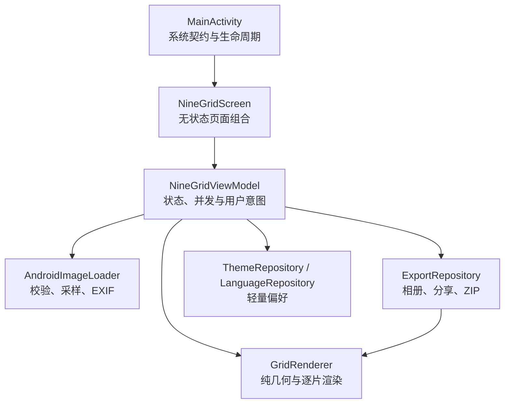

# 隅光 Android 总体方案设计

本文是 Google Play 应用 ID `app.cornerlight.ninegrid` 的原生 Android 客户端设计基线和接手入口。

## 1. 目标与边界

### 产品目标

- 首次打开即可理解：选择一张照片，自动得到按发布顺序编号的切图。
- 不登录、不上传、无水印；核心路径离线可用。
- 在中低端 Android 设备上保持较低安装体积和稳定内存峰值。
- 适配四宫格、九宫格、十二宫格，并支持裁剪、留白、背景色和清晰度。
- 使用系统能力完成选图、保存、分享和 ZIP 位置选择，减少自建权限与文件管理逻辑。

### 非目标

- 不提供账号、云同步、模板市场、在线素材或服务端图片处理。
- 不静默读取整个相册，不后台保存，不采集图片内容。
- 不与浏览器版共享运行时代码，也不使用 WebView。

## 2. 技术选择

- Kotlin + Jetpack Compose：单 Activity、声明式界面和单向数据流。
- `Bitmap` + `Canvas`：算法简单、输出确定、无需引入重型图像框架。
- `StateFlow` + 协程：可取消的预览生成和顺序导出。
- 显式 `AppContainer`：依赖数量少，避免为小工程引入反射式 DI 和额外生成代码。
- Android Photo Picker、MediaStore、FileProvider、Storage Access Framework：文件授权交给系统。

没有数据库和网络层。深浅色主题和界面语言是仅有的持久化偏好，使用 `SharedPreferences`。

## 3. 架构与职责



| 包/文件 | 职责 | 不应承担 |
| --- | --- | --- |
| `MainActivity` | Activity Result、权限回调、系统分享、Compose 入口 | 图片算法、编辑状态 |
| `ui/editor` | 页面组合、不可变 UI 状态、用户意图调度 | ContentResolver 和文件写入 |
| `ui/components` | 可复用视觉组件和手势 | 导出与持久化 |
| `core/model` | 经校验的领域模型 | Android 生命周期 |
| `core/image` | 采样规则、网格几何、单片 Bitmap 渲染 | 相册 URI 和界面文案 |
| `data/image` | URI 元数据、格式解码、像素/体积限制、EXIF | 编辑流程 |
| `data/export` | MediaStore、缓存分享文件、ZIP | UI 状态 |
| `data/preferences` | 主题与语言偏好持久化 | 业务数据 |

`NineGridScreen` 只负责页面级路由；`LandingContent` 负责首屏转化，`EditorContent` 负责编辑工作台。新增较大的独立区域时，优先放入同级专用文件，不要继续扩张页面入口。

## 4. 核心数据流

### 选择与解码

1. `MainActivity` 通过系统 Photo Picker 获取用户授权的图片 URI，或读取用户主动触发的剪贴板图片导入。
2. `NineGridViewModel.onPhotoSelected` 取消并等待旧预览任务，避免两个大图解码同时占用内存。
3. `AndroidImageLoader` 读取可选元数据，拒绝超过 50 MB 或 8000 万像素的源图。
4. 解码前用 `ImageSampling` 将最长边限制到 4096 像素，并纠正 EXIF 方向。
5. ViewModel 发布新 `SourceImage`，随后在后台生成轻量预览。

### 编辑与预览

界面只提交 `GridSpec`、`CropMode`、留白、颜色、清晰度和焦点坐标。ViewModel 先更新不可变 `EditorSettings`，再以 140 ms 防抖重新生成预览。清晰度只影响 JPEG 编码，因此修改它不会重复生成预览。

`GridGeometry.sourceDrawRect` 是预览和正式导出的共同几何来源：

- `COVER` 使用较大缩放比，铺满组合画布并裁掉溢出区域。
- `CONTAIN` 使用较小缩放比，显示完整原图，空白由背景色填充。
- 焦点坐标取值 `0..1`，决定溢出或空白在水平、垂直方向的分配。

### 导出

`ExportRepository` 按从左到右、从上到下的顺序逐片执行：

1. 创建单张 1080 × 1080 Bitmap。
2. 用共享几何规则绘制并按设置质量编码 JPEG。
3. 立即回收该 Bitmap，再处理下一片。

工程从不创建 `4320 × 3240` 一类完整组合 Bitmap，因此批量导出内存峰值接近“源图 + 一个导出切片 + 预览集合”，而不是全部成片之和。

## 5. 状态、并发与资源生命周期

- `EditorUiState` 是页面唯一事实来源；Snackbar、系统分享、权限和创建文档是一次性 `EditorEffect`。
- 任一时刻最多有一个有效预览任务和一个导出任务。
- 参数连续变化会取消旧预览；生成完毕后仍会比较源 Bitmap 身份和设置快照，过期结果不会进入界面。
- 导出期间锁定会改变源图或设置的操作，导出始终使用启动时快照。
- 状态切换后延迟 120 ms 回收旧 Bitmap，给 Compose 留出完成上一帧绘制的窗口。
- 所有临时导出位于应用缓存；相册和用户选择的 ZIP 是显式持久输出。

调整并发逻辑时，必须同时检查“取消后生成的 Bitmap 是否回收”和“界面是否仍可能绘制旧 Bitmap”。

## 6. 权限与隐私

| 能力 | Android 10+ | Android 7–9 |
| --- | --- | --- |
| 选择照片 | Photo Picker 单 URI 授权，无相册权限 | 系统兼容选择器，无全相册读取权限 |
| 保存相册 | MediaStore，无存储权限 | 点击保存时申请 `WRITE_EXTERNAL_STORAGE` |
| 分享 | FileProvider 临时读授权 | FileProvider 临时读授权 |
| ZIP | 用户通过系统文件选择器决定位置 | 相同 |

Manifest 不声明 `INTERNET`。如果未来引入统计或网络能力，必须先更新隐私说明、数据清单和商店 Data safety，并保持统计事件不包含图片、URI、文件名等内容。

## 7. 错误处理原则

- 在最接近错误来源的位置提供中英文错误信息，再按当前界面语言显示：体积超限、像素超限、无法解码、权限拒绝和写入失败。
- 可选元数据读取失败不阻断图片解码；真实图片流打不开才失败。
- MediaStore 写入采用 `IS_PENDING`，失败时删除未完成记录，避免相册残留空文件。
- 不吞掉协程取消；`CancellationException` 必须继续抛出。
- `OutOfMemoryError` 只在图片解码边界转成可恢复提示，不能作为日常控制流。

## 8. 测试策略

```text
JVM 单元测试（每次提交）
├── 网格几何与焦点边界
├── 图片采样策略
├── 编辑参数契约
├── 导出命名与发布顺序
└── 中英文切换与文案选择

Android 仪器测试（设备/模拟器）
├── Canvas 渲染与背景留白
├── ContentResolver 图片解码
├── FileProvider 分享与 ZIP 内容
└── Compose 首屏主操作与中英文切换

发布前人工验收
├── 厂商相册与 HEIC/超大图
├── Android 7–9 权限拒绝/再次授权
├── 微信、小红书等目标分享入口
└── 低内存设备连续换图和十二宫格导出
```

常用命令：

```bash
cd nine-android
./gradlew testDebugUnitTest lintDebug
./gradlew assembleDebugAndroidTest
./gradlew connectedDebugAndroidTest   # 需要已连接设备或模拟器
./gradlew assembleDebug assembleRelease bundleRelease
```

仪器测试 APK 编译成功只证明测试代码可打包，不等同于已在真机执行。交接和发布记录应明确区分两者。

## 9. 新人接手路径

建议按以下顺序阅读：

1. `core/model/EditorSettings.kt` 与 `GridSpec.kt`：理解产品参数。
2. `core/image/GridGeometry.kt` 与 `GridRenderer.kt`：理解输出算法和内存策略。
3. `ui/editor/EditorUiState.kt` 与 `NineGridViewModel.kt`：理解状态和并发。
4. `MainActivity.kt`：理解平台边界。
5. `data/image`、`data/export`：理解文件生命周期和系统版本差异。
6. 对应测试：确认每条关键契约如何被验证。

### 常见扩展

- 新网格规格：增加 `GridSpec` 枚举值，补 `GridSpecTest`、几何测试和渲染测试；现有 UI 会自动读取枚举列表时才可无额外改动，修改前先确认组件实现。
- 新输出格式：不要在 ViewModel 拼编码逻辑；在导出层引入格式策略，并同步 MIME、扩展名、压缩方法与分享类型。
- 新图片设置：先在 `EditorSettings` 声明并校验，再接 ViewModel 意图、预览组件和渲染器，最后补纯逻辑与 Bitmap 测试。
- 新持久偏好：只保存轻量设置，不持久化 Bitmap 或第三方临时 URI。

## 10. 构建、签名与发布检查

- 使用 JDK 17、Android SDK 36；最低 API 24，目标 API 36。
- 发布密钥和密码只能通过本机 Gradle 属性或 CI Secret 注入，不能提交仓库。
- Release 开启代码压缩和资源收缩；商店优先上传 AAB。
- 发布前执行单测、Lint、仪器测试、Debug/Release/AAB 构建，并在至少一台 Android 10+ 真机完成核心路径。

## 11. 当前已知边界

- CI 尚不能替代真实厂商相册、文件提供方和第三方分享应用兼容性验证。
- Android 7–9 的公共相册保存仍依赖旧存储权限，应作为兼容路径逐步减少用户占比。
- 应用目前没有匿名产品统计；功能取舍需要通过商店反馈或后续合规的无图片事件统计验证。
- 分享文件按会话隔离；应用会在下次准备分享时清理超过 24 小时的旧缓存，Android 系统也可能自行清理缓存。不要把 `cache/share` 当作长期存储。

本设计以“一个核心任务、低权限、低内存、少依赖”为约束。新增功能若明显扩大权限、安装体积或首屏决策数量，应先说明它对核心转化的必要性。
